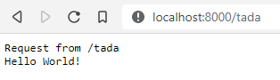

# Deno (Hello World)

A hello world app written using [Deno](https://deno.land/).

Deno is currently in preview, and so this hello world app may break as the Deno project continues to evolve.

# Getting Started

Install [Deno](https://deno.land/#install)

Start the app from a terminal in this directory by running:
```sh
deno run --allow-net app.ts
```

Open your browser at `http://localhost:8000/`. You'll see `Request from` and the path of the request (`/` in this example), and `Hello World!`


